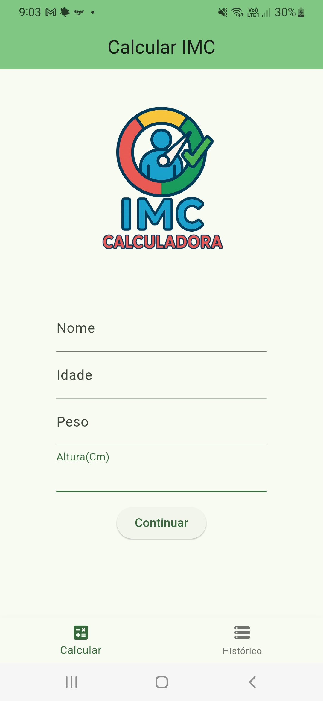
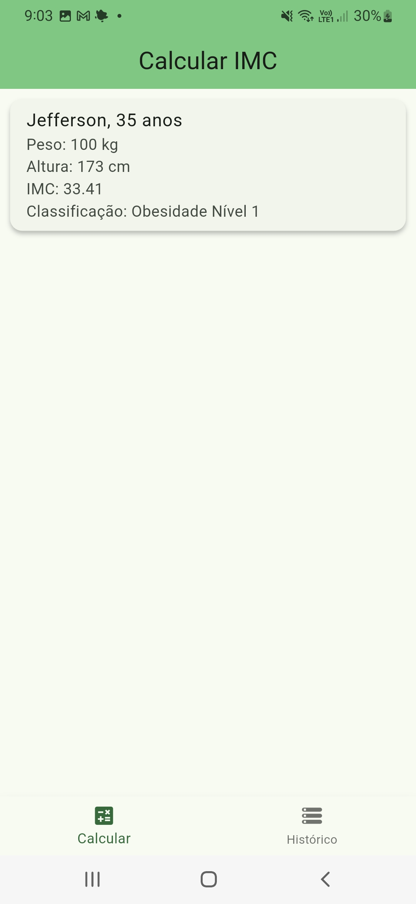

# 📱 Calculadora de IMC - Flutter

Este é um aplicativo Flutter desenvolvido como parte do **Bootcamp Santander - Mobile com Flutter**, com o objetivo de calcular o Índice de Massa Corporal (IMC) de uma pessoa com base em informações como nome, idade, peso e altura. Após o cálculo, o app exibe a classificação do IMC e armazena o histórico das medições.

## ✨ Funcionalidades

- Preenchimento de formulário com nome, idade, peso e altura
- Validação de campos
- Cálculo automático do IMC
- Classificação com base no valor do IMC
- Tela de resultado com mensagem personalizada
- Histórico de resultados com possibilidade de exclusão

## 💡 Tecnologias utilizadas

- Flutter
- Dart
- Widgets básicos: `TextField`, `ListView`, `Column`, `Row`, `ElevatedButton`, `Card`, `SnackBar`
- Gerenciamento de estado com `StatefulWidget`

## 📷 Capturas de tela

  
  
  

🧪 Estrutura do projeto

graphql
Copiar
Editar
lib/
├── models/           # Modelos de dados como IMC e Resultado
├── pages/            # Telas como Formulário e Resultado
├── widgets/          # Componentes reutilizáveis como o logo
├── main.dart         # Arquivo principal

📚 Aprendizados

Durante o desenvolvimento, foram trabalhados conceitos como:

Componentização de widgets

Validação de formulários

Navegação entre telas

Manutenção de histórico e gerenciamento de estado

👨‍💻 Autor
Jefferson Adão - @Jeffersonadao
